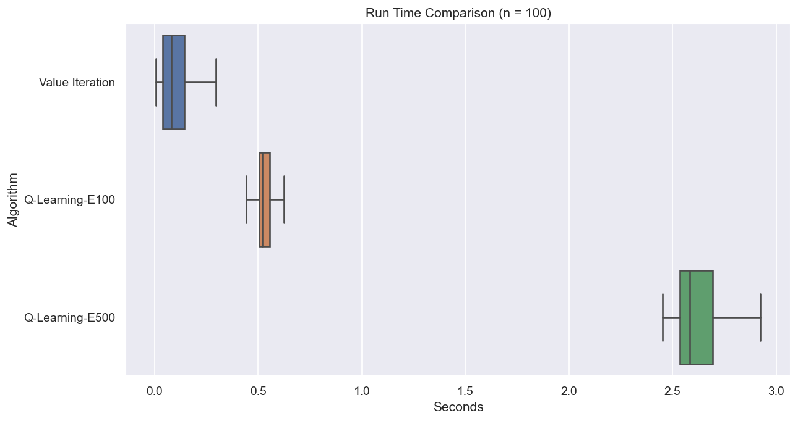

# Reinforcement Learning -- Theoretical Introduction and Applications

During my Bachelor Thesis at _Karlsruhe Institute of Technology (KIT)_ I introduced the theoretical aspects of Reinforcement Learning, such as the _Markov Decision Process (MDP)_ .
To amplify the theory I implemented RL algorithms that are foundamental in this area of study. Namely:
* Value Iteration
* Q-Learning

Many further, complex algorithms, such as [Deep Q-Networks (DQN)](https://arxiv.org/pdf/1312.5602.pdf) are based on Q-Learning.

## Application :rocket:
I applied Value Iteration and Q-Learning to the following 3x4 grid world to keep things simple.

In the run time comparison the Value Iteration algorithm won, due to the convergence implementation. In Q-Learning I had to provide the algorithm with an arbitrary number of episodes (on the plot: 100 respectively 500). However, Q-Learning is a model-free algorithm, which means it does not need the transition probability. This fact made Q-Learning more prominent and fundamental in the area of Reinforcement Learning.

## Q-Learning :joystick:
The jupyter notebook `q_learning_pokemon` contains the Q-Learning algorithm to find the shortest path to the Pokémon as seen below:

The __return__ of each episode, i.e. the sum of rewards, can be seen in the following graph. The number of high return episodes increases with the number of episodes. The variance is due to how I implemented Q-Learning: In each episode, the agent starts at a random (valid) start state. Therefore, the path lengths varies. Thus the return varies, since each state transition costs 0.05 and the only terminal state yields a reward of 100.

